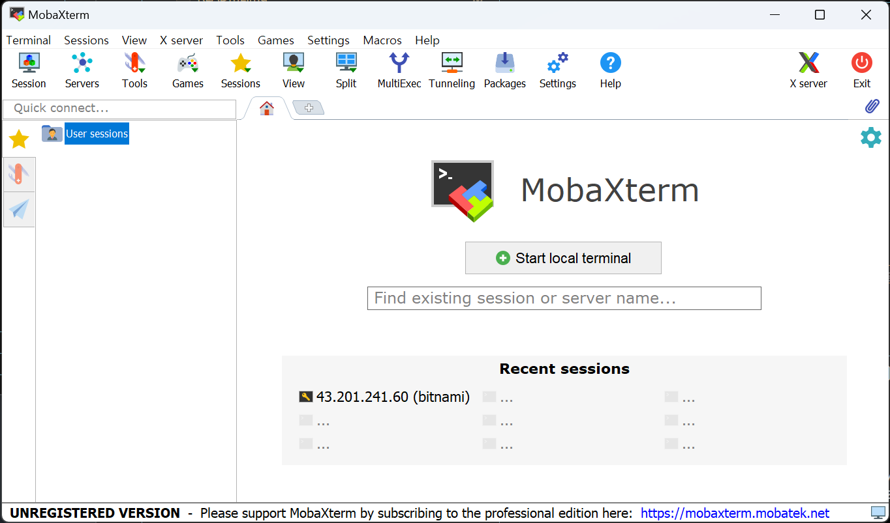

# aws에 ssh 연결
## `윈도우11` `bash shll` `vscode` `mobaxterm`

- 클라이언트에서 2048 비트의 RSA키 생성  
  - `ssh-keygen -t rsa -b 2048 -f [파일명]  
  - `Enter passphrase (empty for no passphrase):` 추가 보안설정임 그냥 엔터로 넘어가도됨. (다음뜨는거는 동일한 값입력)
  
    &darr; `\` &darr; `bash shell`
    ```bash
    ssh-keygen -t rsa -b 2048 -f dohokin.pem
    ```

    

    <br>

- 클라이언트에서 생성된 파일중 `.pub` 내용 복사해서, 서버의 `~/.ssh/` 경로의 `authorized_keys` 파일에 내용 붙여넣기   
  - `cat [.pub 파일]`  

    &darr; `\` &darr; `bash shell`
    ```bash
    cat dohokin.pem.pub
    ```

    

<br>

- 서버에 경로 만들고 권한주기  

  ```bash
  mkdir ~/.ssh/
  ```

  ```bash
  chmod 700 ~/.ssh/
  ```  

  ```bash
  touch ~/.ssh/authorized_keys
  ```

  ```bash
  chmod 600 ~/.ssh/authorized_keys
  ```


- 서버의 `~/.ssh/` 경로의 `authorized_keys` 파일에 내용 붙여넣기  
  - nano편집기 `Ctrl + x` 종료 / 종료시 저장 옵션 `Y` 누르고 파일명 동일하게 저장하기


  

  


- nobaXterm에 접속하기  

  

  

  


