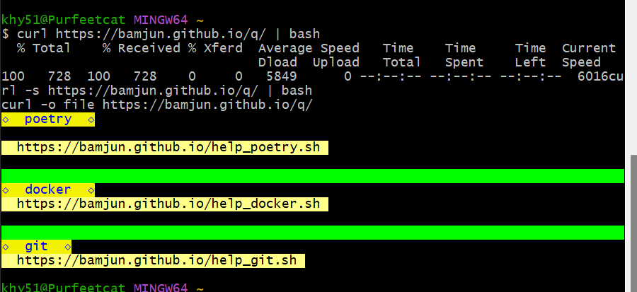
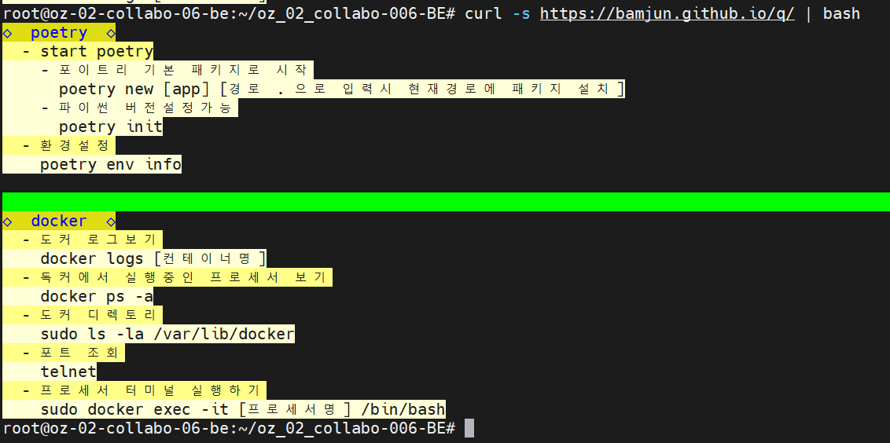
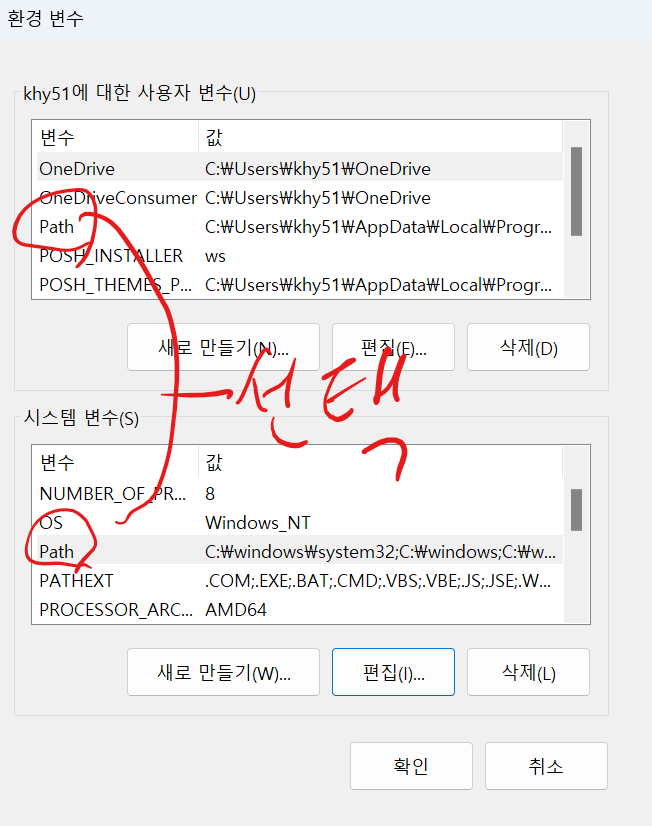
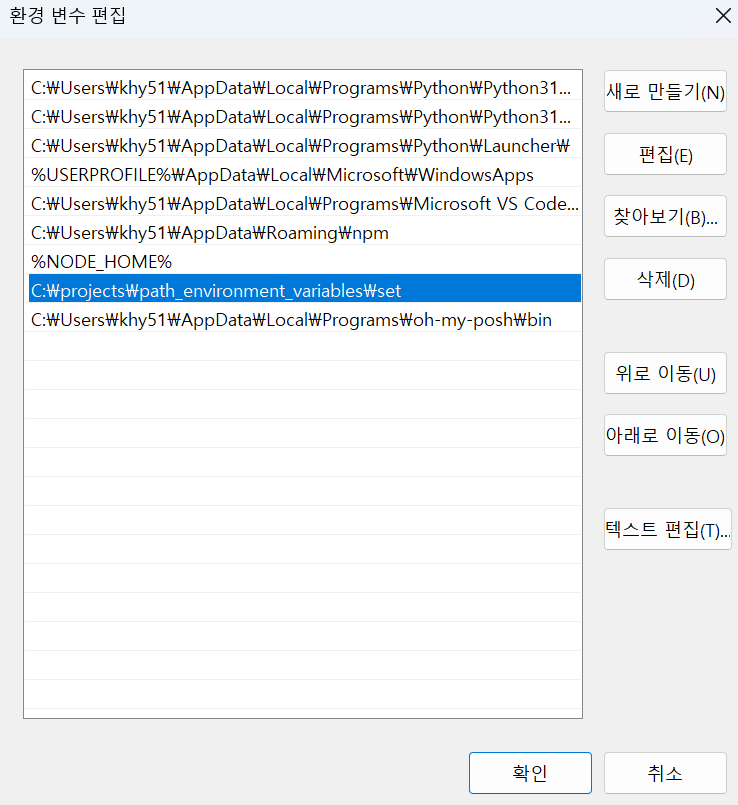
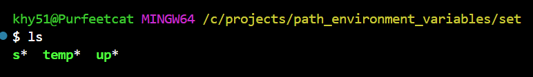
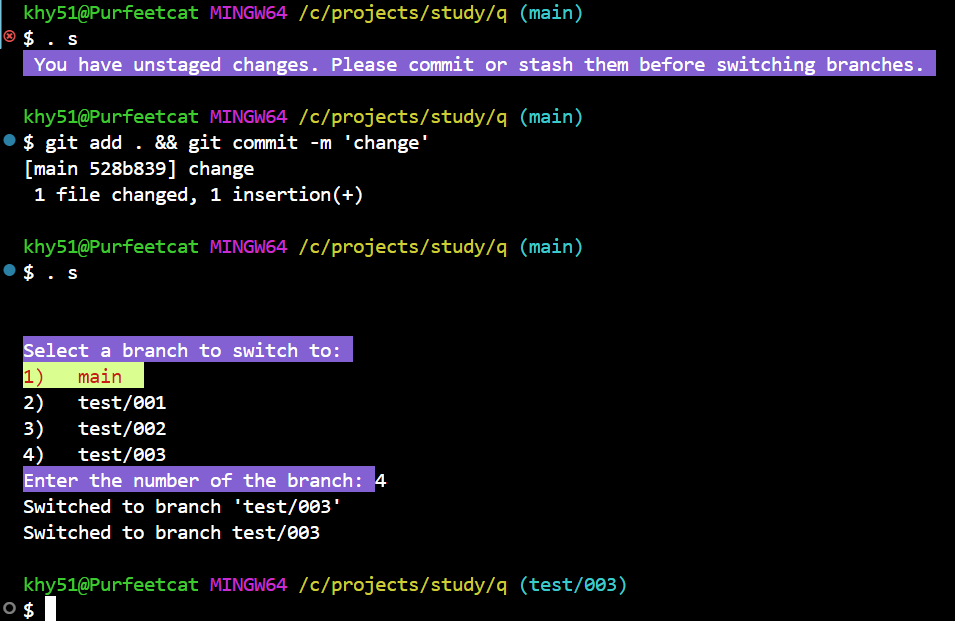

> 여러 환경에서 작업할때 기억안나는 명령어를 보거나, 
> 기존 사용하는 쉘스크립트를 다운 받기위한 레포지토리
> 리눅스 서버나 내가 사용하는 환경이아닌 새로운 환경에서 터미널은 존재하고 curl은 기본적으로 거의 다 설치 되어있어서,
> curl을 활용해서 자주 사용하는 쉘스크립트를 버전관리하거나 다운 받는다.
> 리눅스 서버환경에서 명령어가 기억안나는 경우 `curl https://bamjun.github.io/q/` 를 입력하면 만들어 둔 도움말 파일 경로가 나타난다.



# curl 에서 사용하기

```bash
curl https://bamjun.github.io/q/
```

> `-s` curl 실행시 다운로드 로그를 안보이게함
> `-o` 파일다운로드 옵션 `curl -o [svae file name] [download url]

### 스크립트 바로실행

- `curl -s http://example.com/script.sh`는 지정된 URL에서 스크립트를 다운로드합니다. `-s` 옵션은 silent 모드로 curl의 진행 상황 및 오류 메시지를 숨깁니다.
- 파이프(`|`)를 사용하여 `curl`로 다운로드한 데이터를 직접 `bash`에 전달하고 실행합니다.

  ```bash
  curl -s https://bamjun.github.io/q/ | bash
  ```

    
  <br>
    


### up 파일 다운로드받기

- curl -o [저장할 파일명] [다운로드 url]  

  ```bash
  curl -o up https://bamjun.github.io/q/up
  ```


### temp 임시 폴더만들기
  `/c/projects/temp/Folder_{tody_ymd}` 경로에 임시작업용 폴더만들기.  

  ```bash
  curl -o temp https://bamjun.github.io/q/up
  ```


  ---

  ---

  ---
    
    
# Windows 작업환경  

> 윈도우 환경 변수에 쉘스크립트를 저장한 경로를 추가하고,
> 터미널의 어느 경로에서든지 쉘스크립트 실행해서 빠른 작업환경 구축.  
> 나는 사용자 변수에 쉘스크립트가 있는 폴더 경로를 추가했다.  

  

  

  

  

- `git switch [브랜치]` 를 활용해서, 브랜치를 변경할 필요없이, `. s`로 브랜치 변경.  

  

