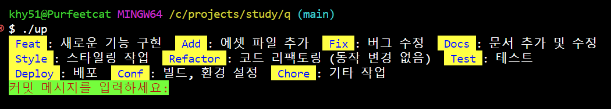

# 버전 관리

---  

# temp  

### 0.0.1  
- 당일의 폴더 만들어서 이동.  

### 0.0.2 
- 당일의 임시폴더안에 001~999 폴더 생성.

### 0.0.3 
- 설명추가

---  

# up  

### 0.0.1  
- 레포지토리 버전과 틀리면 다운받을지 선택하는 기능.  
- 레포지토리에서 덮어쓰기하면서 받을때 실행중인 스크립트 경로에 다운받음.  

### 0.0.2  
- 커밋메세지에 컬러추가  

  

---  

# git_switch.sh

### 0.0.1
- 번호로 깃 브랜치 변경
- 변경사항이 커밋이 안되어 있으면, 브랜치 변경안하고 종료

---
